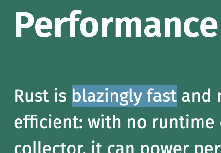

# NominalScript: Nominal type system over JavaScript/TypeScript with runtime checks and well-proven semantics

*Note: TODO things are not actually implemented. This entire project is in the early stages and extremely buggy*

NominalScript is a superset of TypeScript which adds another nominal type system on top of TypeScript's structural one. **Nominal** means that 2 types can be inconvertible even if they both have the same structure, e.g. 2 number types can be inconvertible even though they're both numbers. Furthermore, NominalScript has built-in runtime type checking (TODO), so when you upcast an argument with illegal structure it throws a type error; and you can add arbitrary **guards** (predicates) to types which will enforce additional constraints like `x > 0` or `Math.round(x) === x`. The type system has other minor differences as well: explicit `Integer` and `Natural` types (which are automatically assigned to number literals), and optional variance bounds on generics.

TODO diagram showing TypeScript's type system and NominalScript's type system, with types as circles / regions and values as points.

## Why *another* type system?

NominalScript lets you add even more type-safety to your existing TypeScript projects like how TypeScript lets you add more safety to your JavaScript projects. TypeScript is an amazing innovation and is not going away anytime soon, but there are a few downsides:

- **No zero cost primitive wrappers, native integer type, enforced variance bounds, contracts** 
- **No runtime type-checking** (except JavaScript): values at runtime can actually be bound to the wrong type, and they will not throw `TypeError`, they will simply be passed around until a null value is accessed or another illegal operation occurs. They will then raise a misleading error that does not point to the real cause, or raise no error at all, potentially introducing serious bugs and security vulnerabilities.
  - There have been prior attempts to generate guards which check TypeScript types at runtime, but they are still experimental: see [ts-runtime](https://fabiandev.github.io/ts-runtime/) and [ts-type-checked](https://github.com/janjakubnanista/ts-type-checked). Furthermore, TypeScript's complexity makes it [literally](https://github.com/microsoft/TypeScript/issues/14833) [impossible](https://en.wikipedia.org/wiki/Halting_problem) to fully check all of its types, and probably very hard to even check most of them.
  - There's also a performance concern: even if you could check all TypeScript's types, doing so would almost certainly have incredible performance overhead. Implicit and explicit casts are very common in most TypeScript code-bases, and this problem has been shown in Typed Racket in [*Is Sound Gradual Typing Dead?*](https://www2.ccs.neu.edu/racket/pubs/popl16-tfgnvf.pdf) (see section 4.2). NominalScript provides an effective compromise by letting you have *some* types whose values are checked at runtime, and other (particularly more complex or less important) values/types that are assumed correct.
- **Slower:** `tsc` is very slow, and this is partly due to TypeScript's intrinsic complexity. Not only is NominalScript's type system much simpler, it's written in Rust, which is allegedly [blazingly fast]

But most importantly, like TypeScript, NominalScript is **easy to adopt**. You can add it to an existing TypeScript project and gradually add nominal types, and you retain all capabilities of the TypeScript LSP (TODO). The NominalScript transpiler preserves TypeScript formatting as much as possible, so it's easy to debug, and if you decide NominalScript isn't for you, you can very easily revert back to TypeScript whenever you want (as opposed to having to rewrite all of the NominalScript code or de-obfuscate the transpiled output).

## How to install

Cargo: [download Rustup](https://rustup.rs/), then ~~`cargo install nominalscript`~~ `git clone https://github.com/Jakobeha/nominalscript.git && cargo install --path nominalscript`.

## How to use

Currently only `nominalscript <package-path>`. It will convert NominalScript files in `package-path/src/`, `package-path/lib/`, `package-path/bin/`, and `package-path/tests/` into TypeScript files and put them in  `package-path/out/typescript/`, logging all type errors and warnings.

There are also tests that you can run with `cargo test`. However there honestly aren't that many, there are a few macro tests and a full integration test which essentially does what `nominalscript ./test-resources/nominalscript-package/` would and checks there are no errors or warnings.

## Project structure

This follows the standard [cargo package layout](https://doc.rust-lang.org/cargo/guide/project-layout.html), with the following additions:

- `docs/`: Documentation
- `images/`: Images (for README and documentation)
- `test-resources/`: Test resources
  - `nominalscript-package/`: A sample NominalScript package
- `vendor/`: Third-party libraries
  - `tree-sitter-nominalscriot/`: The tree-sitter grammar for NominalScript. See [its README](./vendor/tree-sitter-nominalscript/README.md) for more information.

### Source structure

- `analyses/`: Static analysis including type checking and inference (some inference is in `compile` though)
  - `scopes/`: Scopes and scope/DU analysis (when we encounter a use, we lookup its definition)
  - `types/`: Type checking and inference
    - `thin.rs` Thin types and thin/fat agnostic functionality like `TypeIdent`, `TypeStructure`, etc.
    - `fat/`: Fat (resolved) types
    - `resolve.rs`: Resolved lazy types, which consist of a thin type, pointer to its scope, and lazily-computed (`OnceCell`) fat type. This allows for recursive type resolution even across module boundaries. Also `ResolveCtx` which contains data like the logger and is necessary to resolve a type
    - `loc.rs`: Type location description for subtype diagnostics
    - `determined.rs`: "Determined" types are types with AST location data from where and how they were determined
  - `bindings.rs`: Bindings (definitions) base traits and datastructures (including typed identifiers)
  - `global_bindings.rs`: Global bindings
  - `global_bindings.ns`: NominalScript file containing the code for global bindings, which is lazily loaded by `global_bindings.rs`
- `ast/`: Syntax
  - `typed_nodes.rs`: Typed nodes (tree-sitter nodes with their type explicitly checked, and sub-node and some semantic data)
  - `queries.rs`: Tree-sitter queries
  - `tree_sitter.rs`: Tree-sitter wrapper to make the API more convenient
- `diagnostics/`: Errors, warnings, info, debug messages
  - `data.rs`: Datastructures
  - `logging.rs`: Wrappers which let you use those datastructures to actually log, and also macros to make logging easy
- `import_export/`: Imports and exports
  - `export.rs`: Exports
  - `import_cache.rs`: Stores modules (files) in a project so they are not re-compiled and also can have cyclic dependencies
  - `import_resolver.rs`: Algorithm to resolve a module path (e.g. `foo` in `import { Bar } from "foo"`) into an actual path on the filesystem, and also determines if that path points towards a NominalScript module or some other module.
  - `import_ctx`: Allows outside code to use the import cache and resolver, and ultimately resolve a module or script path into an actual module
- `misc/`: Various utility functions which could go in any package
- `project.rs`: Project and project context datastructure. A project is also a package and contains all of your NominalScript source files.
- `compile.rs`: A very large file which does the full AST traversal to compile a program (partly described in [`docs/compile-process.md`](./docs/compile-process.md))
- `main.rs`: The main function which parses command-line arguments and runs the compiler (most of the code is parsing the command line arguments and converting an error to an exit code)

## Documentation

There is a lot more documentation in the source code, you see the rustdoc by running `cargo doc` and then opening [`target/doc/nominalscript/index.html`](./target/doc/nominalscript/index.html).

## License

The code is licensed under [MIT](./LICENSE-MIT) or [Apache 2.0](./LICENSE-APACHE) (you choose), which is the norm for Rust packages.